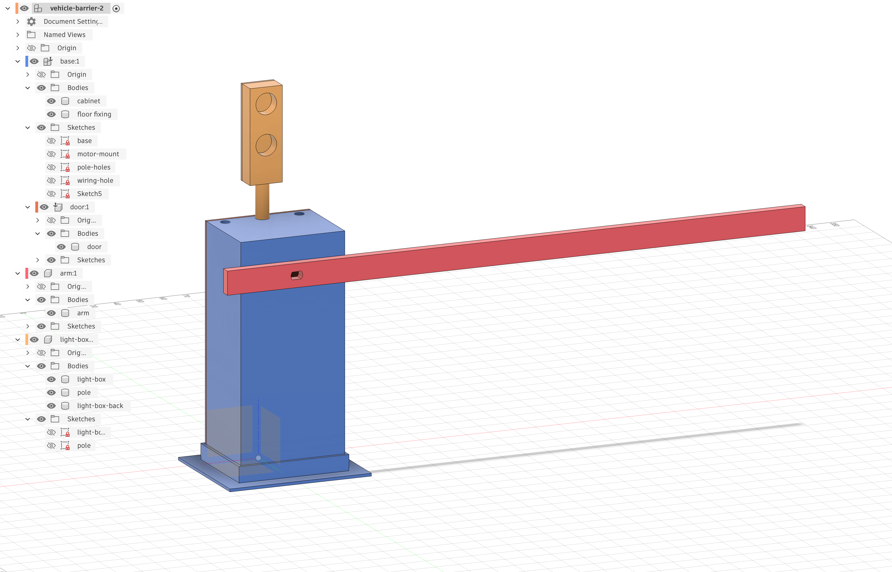

# Arduino Barrier Gate with Ultrasonic Detection, Stepper Motor, and Traffic Lights

This project implements a **miniature vehicle barrier / gate system** using an Arduino Nano.  
It detects approaching vehicles with an ultrasonic sensor, raises and lowers a barrier using a stepper motor, and provides clear **red/green traffic-light feedback** via NeoPixel LEDs.

The design supports:
- Automatic operation via ultrasonic sensing
- Manual *fine alignment* of the barrier at power-on using a jog button
- A hardware switch to reverse direction so the barrier can be mounted on **either side of the road**
- Fully non-blocking motor and sensor logic

---

## Features

- 🚗 **HC-SR04 ultrasonic detection**
- ⚙️ **28BYJ-48 stepper motor with ULN2003 driver**
- 🚦 **NeoPixel traffic lights**
  - Red when barrier is down or moving
  - Green only when barrier is fully up
- ↔️ **Direction reverse slide switch**
- 🎯 **Jog button** for precise alignment when the barrier is down
- ⏱️ Non-blocking code using `AccelStepper`
- 🔌 External motor power (no brown-outs)

### Video Demo

<video width="640" height="480" controls>
  <source src="barrier.MOV" type="video/quicktime">
  Your browser does not support the video tag.
</video>

---

## Hardware Overview

### Core Components
- Arduino Nano (ATmega328P)
- HC-SR04 Ultrasonic Distance Sensor
- 28BYJ-48 5V Stepper Motor
- ULN2003 Stepper Driver Board
- WS2812B / NeoPixel RGB LED strip (2 LEDs)
- SPDT slide switch (2-position) (2, one for barrier direction and one for power on/off)
- Momentary push button
- External 5V power supply (≥1A recommended)

---

## Wiring Diagram (Text)

```
Arduino Nano
============

POWER (COMMON GROUND REQUIRED)
------------------------------
Arduino GND  ------------------ External PSU GND
External 5V  ------------------ HC-SR04 VCC
External 5V  ------------------ ULN2003 +
External 5V  ------------------ NeoPixel 5V

ULTRASONIC SENSOR (HC-SR04)
---------------------------
TRIG  -> D9
ECHO  -> D10
VCC   -> 5V
GND   -> GND

STEPPER DRIVER (ULN2003)
-----------------------
IN1 -> D5
IN2 -> D6
IN3 -> D7
IN4 -> D8
+   -> External 5V
-   -> GND

Stepper motor plugs directly into ULN2003 board.
Leave the jumper fitted on the ULN2003 board.

NEOPIXEL TRAFFIC LIGHTS (2 LEDs)
--------------------------------
DIN  -> D4
5V   -> External 5V
GND  -> GND

LED index usage:
- LED 0 = Green
- LED 1 = Red

DIRECTION SWITCH (SPDT)
-----------------------
COM (middle pin) -> D3
One outer pin    -> GND
Other outer pin  -> Not connected

JOG BUTTON (Momentary)
---------------------
One side -> D2
Other    -> GND
```

> ⚠️ **Important:**  
> All grounds (Arduino, stepper PSU, NeoPixels, sensors) **must be connected together**.

---

## 3D Model / Enclosure

A 3D printable enclosure model is included in this project:
- **barrier.3mf** – Complete 3D model of the electronics enclosure (3MF format)
- **barrier.f3d** – Native Fusion 360 design file (editable)
- **barrier.step** – Standard STEP format for CAD interoperability
- **barrier.csv** – Dimensions and specifications of various aspects of the 3D model

You can open these files in Fusion 360, Blender, FreeCAD, or other CAD tools to view, modify, or print the enclosure.



---

## Behaviour Summary

### Automatic Mode
- Vehicle detected within threshold → barrier raises
- Vehicle leaves → barrier lowers after delay
- Red light is on unless the barrier is fully raised

### Jog Button (Calibration)
- Works **only when the barrier is down and stationary**
- Each button press nudges the barrier by a small number of steps
- Intended for initial alignment so the barrier is parallel to the ground
- Once aligned, the jog button is typically no longer used

### Direction Switch
- Allows the barrier to operate correctly when mounted on either side
- No code changes required

---

## Bill of Materials (BOM)

| Qty | Item |
|---:|------|
| 1 | Arduino Nano (ATmega328P) |
| 1 | HC-SR04 Ultrasonic Sensor |
| 1 | 28BYJ-48 5V Stepper Motor |
| 1 | ULN2003 Stepper Driver Board |
| 1 | WS2812B / NeoPixel LED strip (2 LEDs) |
| 2 | SPDT slide switch (2-position, 3-pin) |
| 1 | Momentary push button |
| 1 | External 5V power supply (≥1A recommended) |
| 1 | 330–470Ω resistor (NeoPixel data line, optional but recommended) |
| 1 | 100–470µF electrolytic capacitor (across 5V/GND near motor driver, recommended) |
| — | Jumper wires, breadboard or PCB |

---

## Software Requirements

- Arduino IDE
- Libraries:
  - **AccelStepper** by Mike McCauley
  - **Adafruit NeoPixel**

Install via **Arduino IDE → Library Manager**.

---

## License

This project is provided as-is for learning and hobby use.  
Feel free to fork, modify, and adapt it for your own projects.
